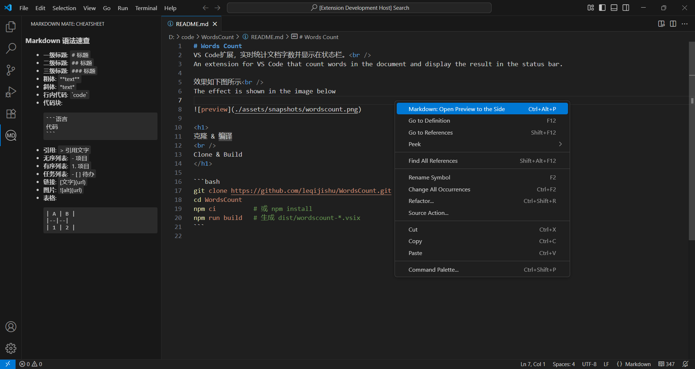

# Markdown Mate
VS Code扩展，为Markdown文档提供侧边预览和语法速查。<br />
An extension for VS Code that gives you one-key side preview and quick sytax lookup.

效果如下图所示<br />
The effect is shown in the image below




<h1>
克隆 & 编译
<br />
Clone & Build
</h1>

```bash
git clone https://github.com/leqijishu/MarkdownMate.git
cd MarkdownMate
npm ci          # 或 npm install
npm run build   # 生成 dist/markdownmate-*.vsix
```